# Servlet/JSP 演習問題

## 第1章 HTTPリクエスト

### 演習1-1

フルーツのチェックボックスを用意し、チェックされたフルーツを次の画面で表示する。


**fruits-list.html**

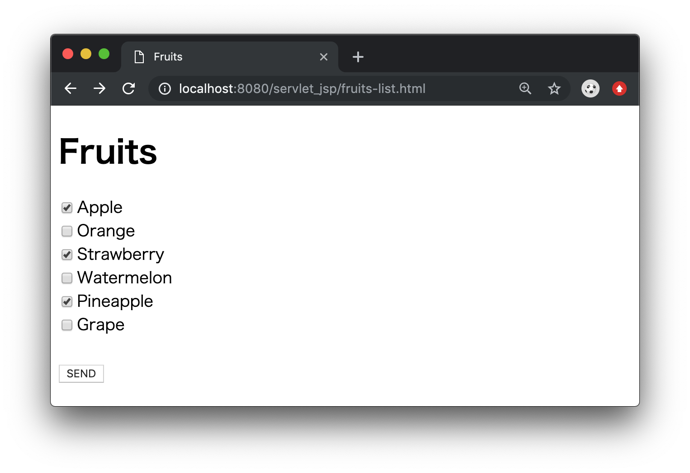

**FruitsListServlet.java** （パッケージ：jp.sample.servlet、@WebServlet：fruitslist）

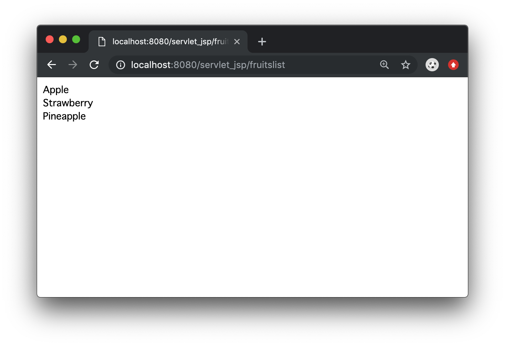

[解答例](/answer/01-01.md)

<br>

### 演習1-2

メールアドレスとパスワードの入力ボックスを用意する。

・メールアドレスが「test@sample.jp」、パスワードが「pass01」の場合、「Login success」と表示<br>
・上記以外の場合、「Login failure」と表示


**login.html**

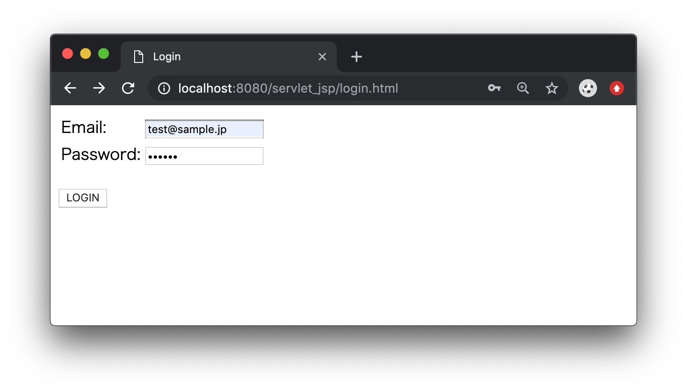

**LoginSampleServlet.java** （パッケージ：jp.sample.servlet、@WebServlet：loginsample）

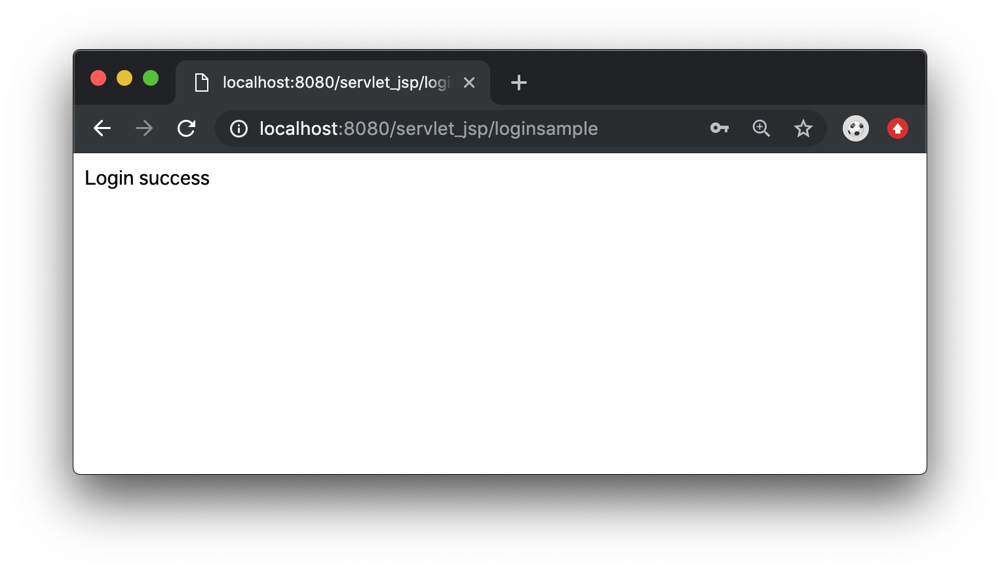


[解答例](/answer/01-02.md)

<br>
<hr>

## 第2章 HTTPレスポンス

### 演習2-1

ログイン時の表示内容を以下のように変更する。<br>
・タイトル：Login<br>
・ログイン成功時：h1タグで「ログイン成功」と表示<br>
・ログイン失敗時：h2タグで「ログイン失敗」と表示<br>

<br>

**LoginSampleServlet.java** （パッケージ：jp.sample.servlet、@WebServlet：loginsample）

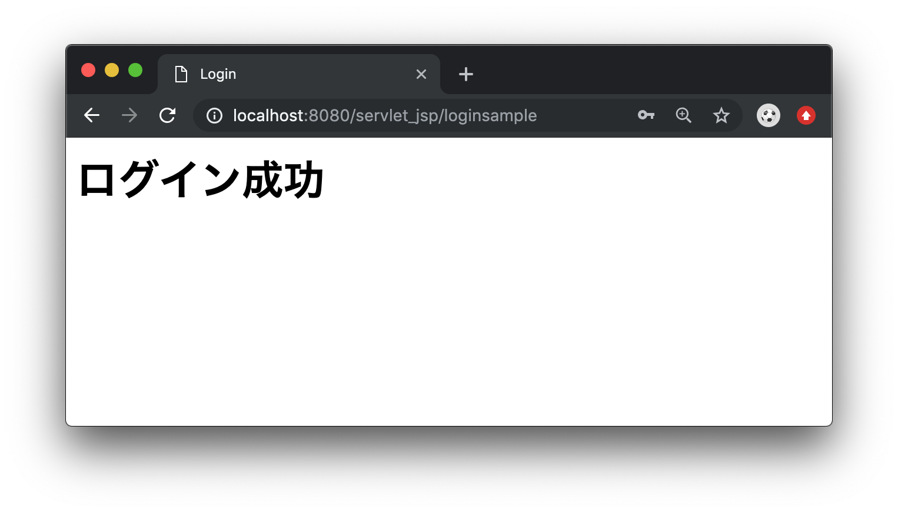

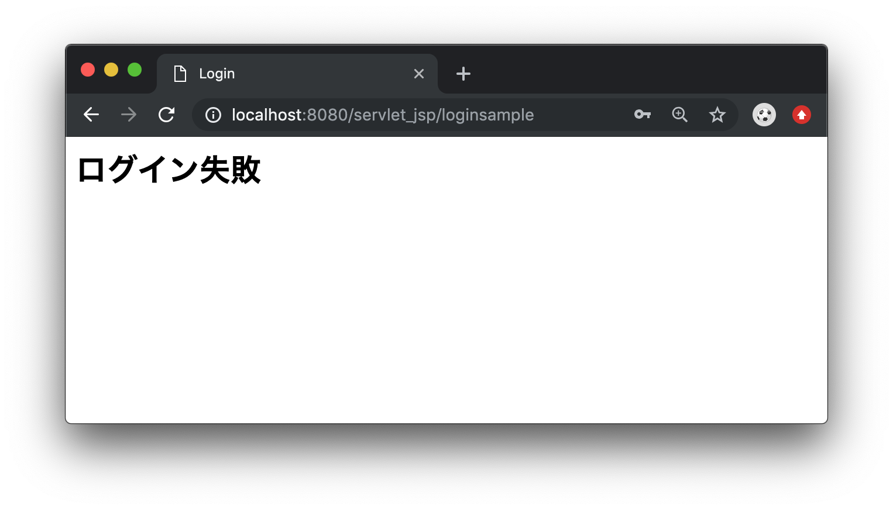

[解答例](/answer/02-01.md)

<br>
<hr>

## 第3章 リクエストのフォワード

### 演習3-1

ログイン時の表示方法を以下のように変更する。<br>
・ログイン成功時：スケジュール一覧を表示するScheduleServletへフォワードする<br>
・ログイン失敗時：ログイン画面へフォワードする<br>

<br>

**Schedule.java** （パッケージ：jp.sample.dto）

**フィールド**

|型|フィールド名|
|--|----------|
|int|ID|
|String|日時|
|String|タイトル|
|String|場所|

**コンストラクタ**

|引数|内容|
|---|----|
|ID、日時、タイトル、場所|引数の各値をフィールドに代入する|

**メソッド**

※各フィールドのsetter/getterを作成する

<br>

**ScheduleServlet.java** （パッケージ：jp.sample.servlet、@WebServlet：schedule）

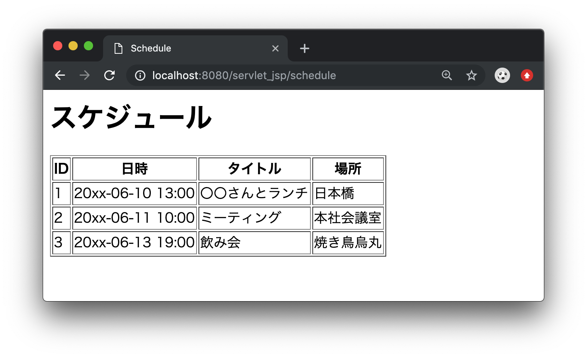

```java
package jp.sample.servlet;

import java.io.IOException;
import java.util.Arrays;
import java.util.List;

import javax.servlet.ServletException;
import javax.servlet.annotation.WebServlet;
import javax.servlet.http.HttpServlet;
import javax.servlet.http.HttpServletRequest;
import javax.servlet.http.HttpServletResponse;

import jp.sample.dto.Schedule;

/**
 * Servlet implementation class ScheduleServlet
 */
@WebServlet("/schedule")
public class ScheduleServlet extends HttpServlet {
    private static final long serialVersionUID = 1L;

    /**
     * @see HttpServlet#doPost(HttpServletRequest request, HttpServletResponse response)
     */
    protected void doPost(HttpServletRequest request, HttpServletResponse response) throws ServletException, IOException {

        List<Schedule> scheduleList = Arrays.asList(new Schedule(1, "20xx-06-10 13:00", "〇〇さんとランチ", "日本橋"),
                            new Schedule(2, "20xx-06-11 10:00", "ミーティング", "本社会議室"),
                            new Schedule(3, "20xx-06-13 19:00", "飲み会", "焼き鳥烏丸"));

        // TODO
    }
}
```

[解答例](/answer/03-01.md)

<br>

### 演習3-2

URL「~/(プロジェクト名)/loginsample」に直接アクセスした場合、ログイン画面が表示されるように修正する。

[解答例](/answer/03-02.md)

<br>
<hr>


## 第4章 レスポンスのリダイレクト

### 演習4-1

POSTでログインし、スケジュール画面（ScheduleServlet）へフォワードしたが、画面を再読み込みするとPOST送信でログイン処理が再度実行される。（再読み込み時に以下のようなメッセージが表示される。）

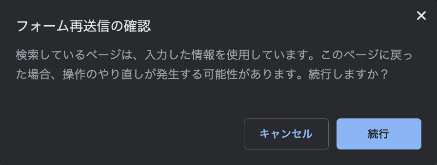

そこで、ログイン成功時のScheduleServletへのフォワードを、ScheduleServletへのリダイレクトに修正する。<br>
また、ログイン失敗時もlogin.htmlへのリダイレクトに修正する。

[解答例](/answer/04-01.md)

<br>
<hr>


## 第5章 セッション

### 演習5-1

ログインの処理を以下のように修正する。

- **LoginSampleServlet.java**　（パッケージ：jp.sample.servlet、@WebServlet：loginsample）
    - ログイン成功時：<br>
    　セッションにメールアドレスを格納する。<br>
    　WelcomServletへリダイレクトする。（ようこそ画面の表示）
    - ログイン失敗時：<br>
    　ログイン画面（login.html）へリダイレクトする。

- **WelcomServlet.java**　（パッケージ：jp.sample.servlet、@WebServlet：welcome）
    - メールアドレスを表示する。
    - スケジュールリンクのクリックで、スケジュール画面へ遷移する。

- **ScheduleServlet.java** （パッケージ：jp.sample.servlet、@WebServlet：schedule）
    - メールアドレスを表示する。
    - スケジュール表を表示する。

<br>

&emsp;ようこそ画面

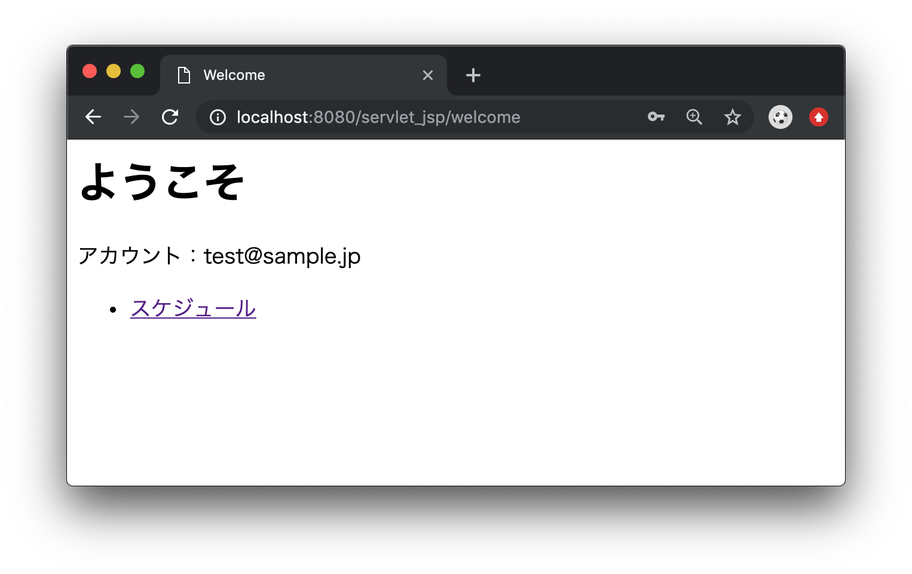

&emsp;スケジュール画面

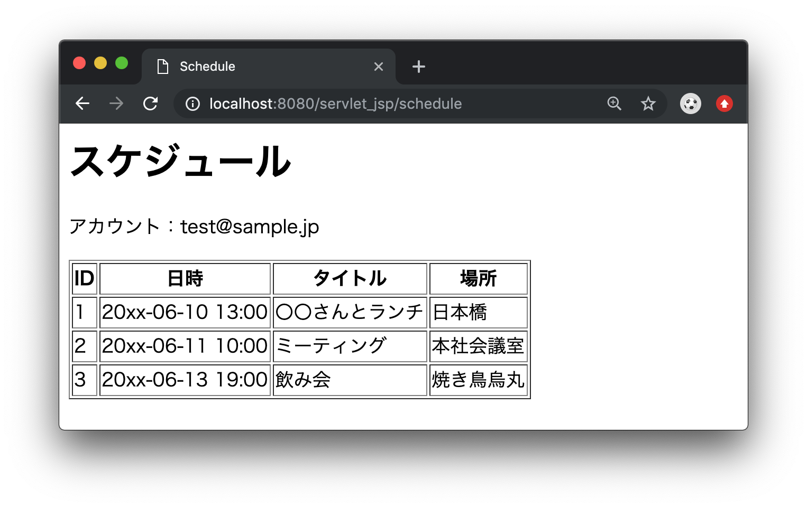

[解答例](/answer/05-01.md)

<br>

### 演習5-2

ようこそ画面にログアウトリンクを追加し、リンククリックでLogoutSampleServletの処理を行う。

- **LogoutSampleServlet.java** （パッケージ：jp.sample.servlet、@WebServlet：logoutsample）
    - セッションを破棄する。
    - ログイン画面にフォワードする。

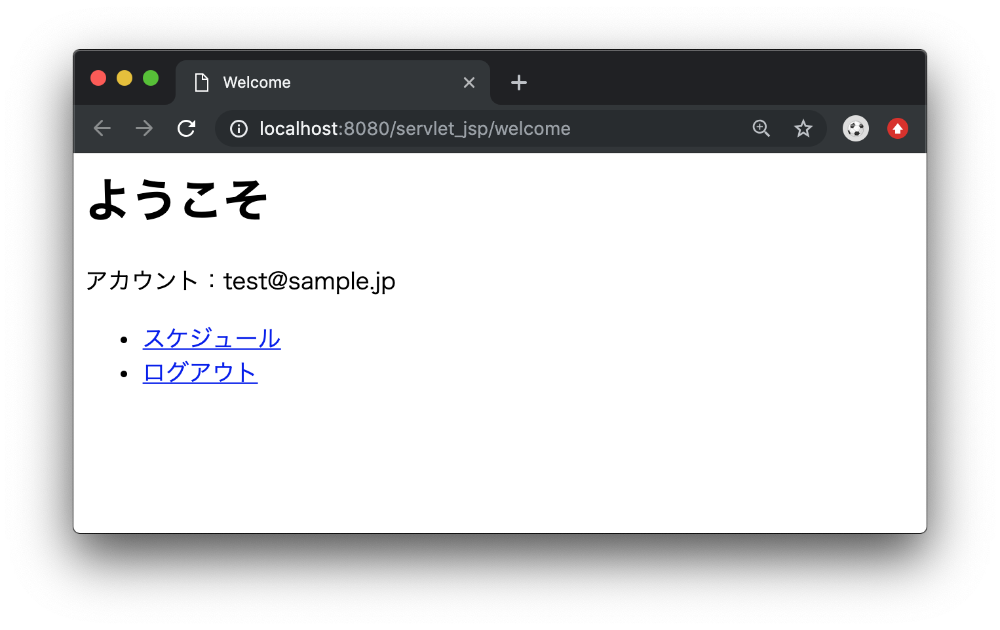

&emsp;ログアウト後

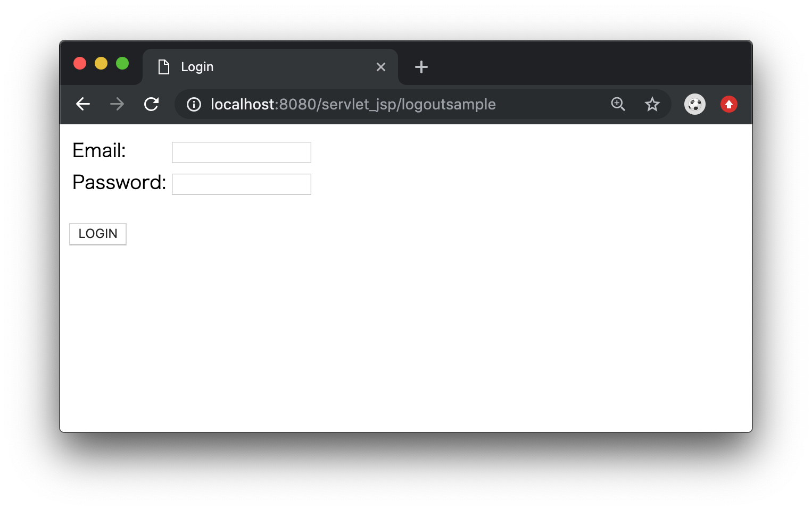

[解答例](/answer/05-02.md)

<br>

### 演習5-3

URL「~/(プロジェクト名)/schedule」に直接アクセスした時、ログイン中でない場合はログイン画面に遷移する。ログイン中の場合はスケジュール画面を表示する。

※他のサーブレットについても同様の対応をしてみましょう。

[解答例](/answer/05-03.md)

<br>
<hr>

## 第6章 JSP

### 演習6-1

サーブレット側でPrintWriterを使ってHTMLを書いていくのは非常に煩雑であるため、主に画面表示をするサーブレットはJSP（JavaServer Pages）に切り替える。

WelcomeServlet内のHTML生成部分を担当するJSPを作成し、WelcomeServletからJSPにフォワードする。

- **welcome.jsp** （配置場所：WebContent/WEB-INF）
- **LoginSampleServlet.java**
    - ログイン成功時、WelcomeServletへリダイレクトする。
- **WelcomServlet.java**
    - welcome.jspへフォワードする。

[解答例](/answer/06-01.md)

<br>

### 演習6-2

ScheduleServlet内のHTML生成部分を担当するJSPを作成し、ScheduleServletからJSPにフォワードする。

- **schedule.jsp** （配置場所：WebContent/WEB-INF）
- **ScheduleServlet.java** （パッケージ：jp.sample.servlet、@WebServlet：schedule）
    - セッションがない場合はログイン画面に遷移する。
    - スケジュールのリストを作成する。
    - スケジュールのリストをリクエストに格納する。
    - schedule.jspへフォワードする。

[解答例](/answer/06-02.md)

<br>
<hr>

## 第7章 EL式、JSTL

### 演習7-1

welcome.jspとschedule.jspをEL式およびJSTLを使用するように修正する。

JSTLは下記URLからダウンロードしてください。<br>
https://tomcat.apache.org/download-taglibs.cgi

[解答例](/answer/07-01.md)
