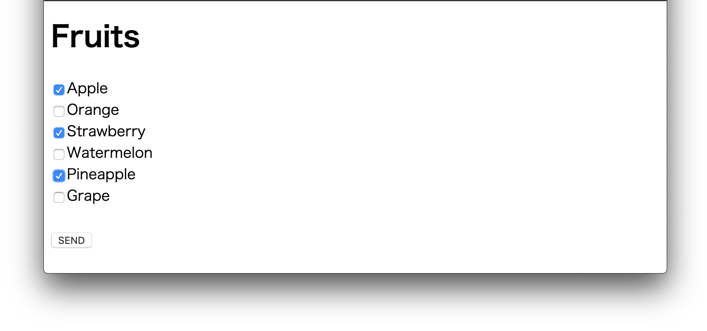
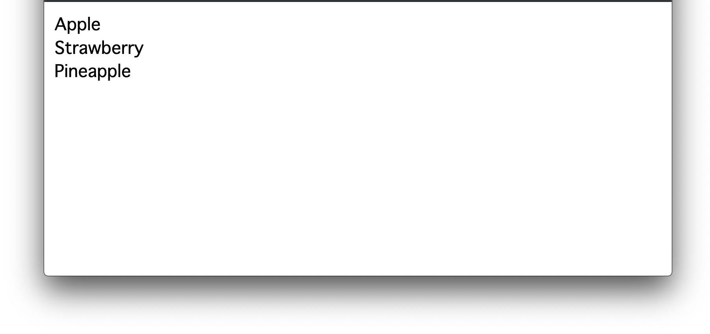
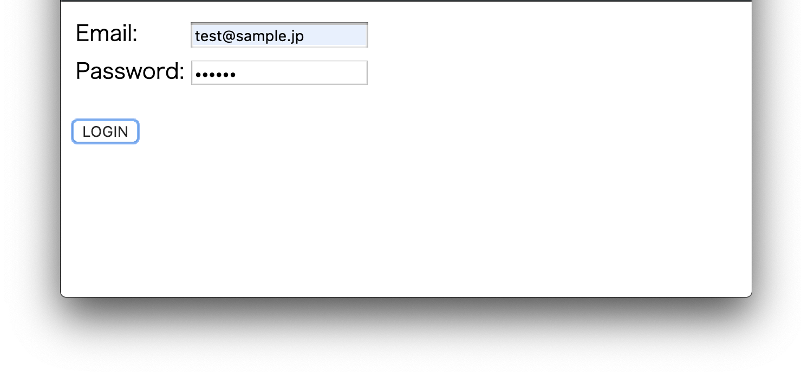
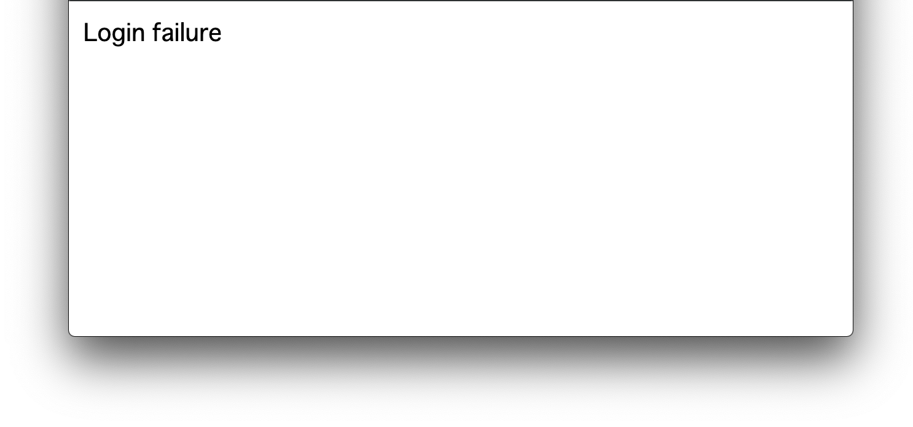

# Servlet/JSP 演習問題

## 第1章 HTTPリクエスト

#### 演習1-1

```
フルーツのチェックボックスを用意し、チェックされたフルーツを次画面で表示する。
```

- fruits-list.html



- FruitsListServlet.java（@WebServlet：fruitslist）




#### 演習1-2

```
メールアドレスとパスワードの入力ボックスを用意する。
・メールアドレスが「test@sample.jp」、パスワードが「pass01」の場合、「Login success」と表示
・上記以外の場合、「Login failure」と表示
```

- login.html



- LoginSampleServlet.java（@WebServlet：loginsample）



